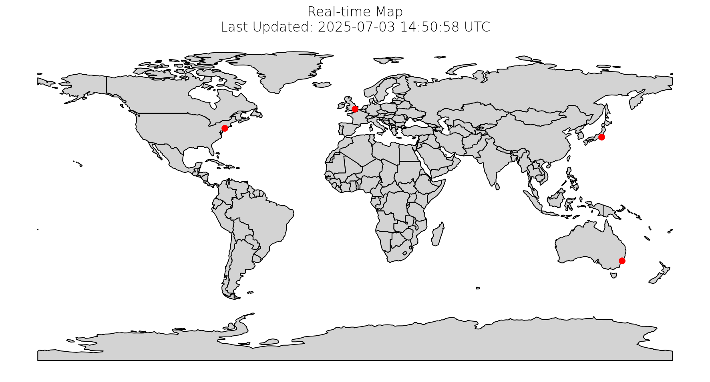

# GeoTessera

Python library interface to the Tessera geofoundation model embeddings.

## Overview

GeoTessera provides access to geospatial embeddings from the [Tessera foundation model](https://github.com/ucam-eo/tessera), which processes Sentinel-1 and Sentinel-2 satellite imagery to generate 128-channel representation maps at 10m resolution. The embeddings compress a full year of temporal-spectral features into useful representations for geospatial analysis tasks.

## Data Coverage



## Features

- Download geospatial embeddings for specific coordinates
- List available embedding tiles
- Visualize embedding data as RGB composite images
- Built-in caching for efficient data management
- Command-line interface for easy access

## Installation

```bash
pip install geotessera
```

## Usage

### Command Line Interface

Use `uvx` to run the CLI without installation:

```bash
# Download embedding for Cambridge, UK
uvx --from git+https://github.com/ucam-eo/geotessera@main geotessera download --lat 52.05 --lon 0.15

# List available embeddings
uvx --from git+https://github.com/ucam-eo/geotessera@main geotessera list --limit 10

# Show dataset information
uvx --from git+https://github.com/ucam-eo/geotessera@main geotessera info

# Visualize embedding as RGB composite
uvx --from git+https://github.com/ucam-eo/geotessera@main geotessera visualize --lat 52.05 --lon 0.15 --output cambridge.png
```

If you have the repository checked out, then use `--from .` instead.

### Python API

```python
from geotessera import GeoTessera

# Initialize client
tessera = GeoTessera(version="v1")

# Download and get dequantized embedding for specific coordinates
embedding = tessera.get_embedding(lat=52.05, lon=0.15, year=2024)
print(f"Embedding shape: {embedding.shape}")  # (height, width, 128)
```

## About Tessera

Tessera is a foundation model for Earth observation developed by the University of Cambridge. It learns temporal-spectral features from multi-source satellite data to enable advanced geospatial analysis including land classification and canopy height prediction.

For more information about the Tessera project, visit: https://github.com/ucam-eo/tessera
